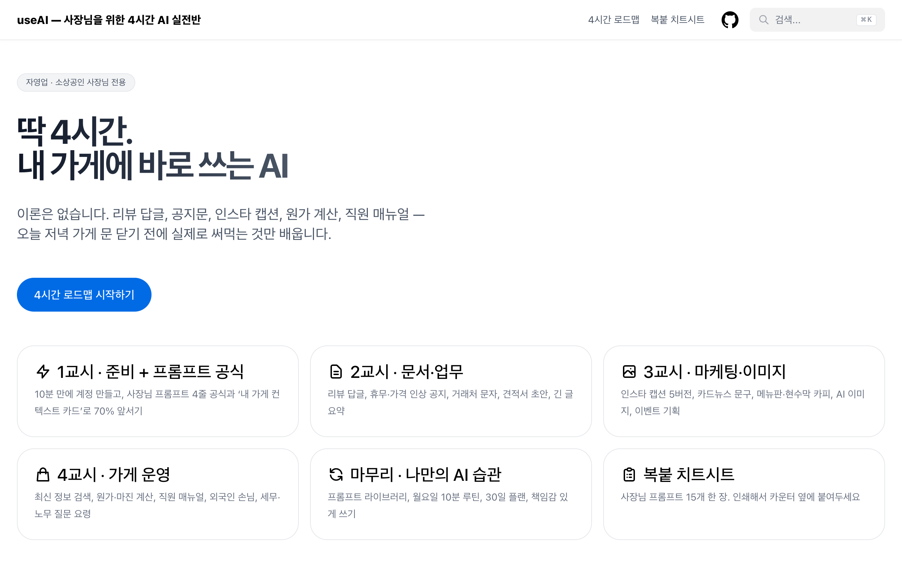

# useAI — 사장님을 위한 4시간 AI 실전반

자영업·소상공인 사장님이 **딱 4시간** 만에 ChatGPT를 내 가게 업무에 바로 써먹게 만드는 교육 자료.

- 사이트: https://useai.metacog.co.kr
- 이론 없음. 모든 페이지가 "복붙 프롬프트 → 결과 → 다듬기".
- 무엇부터 배우고, 무엇은 완전히 무시해도 되는지 순서를 정해 줌.
- 한 번만 해봐도 앞서는 연습: **내 가게 컨텍스트 카드**.



## 구성

| 교시 | 내용 |
|---|---|
| 1교시 | 10분 준비, 프롬프트 4줄 공식, 내 가게 컨텍스트 카드 |
| 2교시 | 리뷰 답글, 공지문, 거래처 문자, 견적·제안서, 메모 요약 |
| 3교시 | 인스타 캡션, 카드뉴스, 매장 카피, AI 이미지, 이벤트 기획 |
| 4교시 | 정보 검색, 원가·가격, 직원 매뉴얼, 외국인 손님, 세무·노무·계약 질문 요령 |
| 마무리 | 프롬프트 라이브러리, 주간 루틴, 30일 플랜, 책임감 있게 쓰기 |
| 치트시트 | 복붙 프롬프트 15개 한 장 |

## 로컬 실행

```bash
hugo server
```

Hugo Extended 0.161+ 필요. 테마: [Hextra](https://github.com/imfing/hextra) (`themes/hextra`에 직접 포함).

## 배포

`main` 브랜치 push → GitHub Actions → GitHub Pages (`static/CNAME` = useai.metacog.co.kr).
